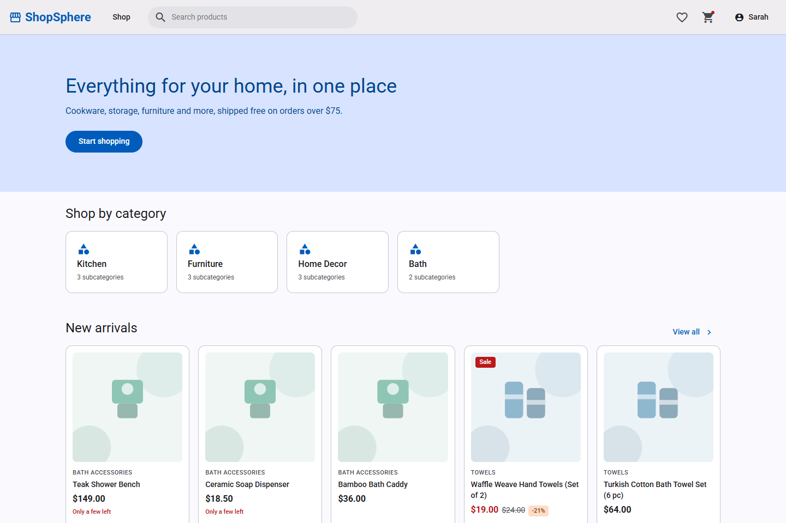
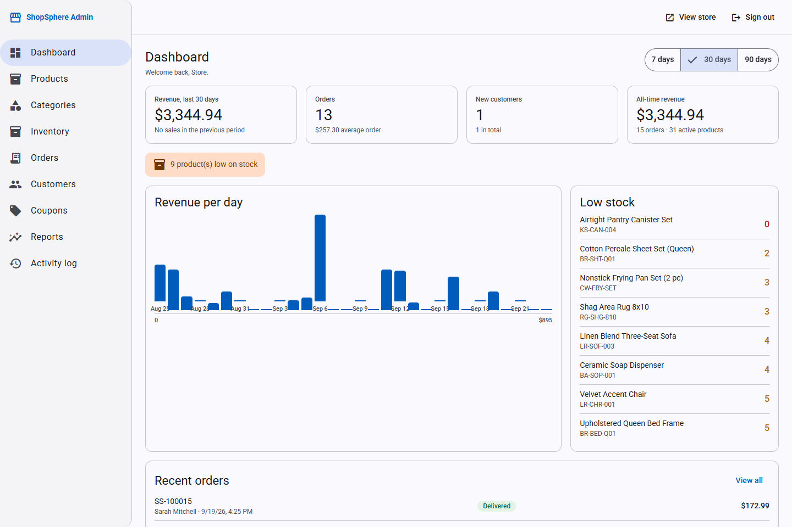
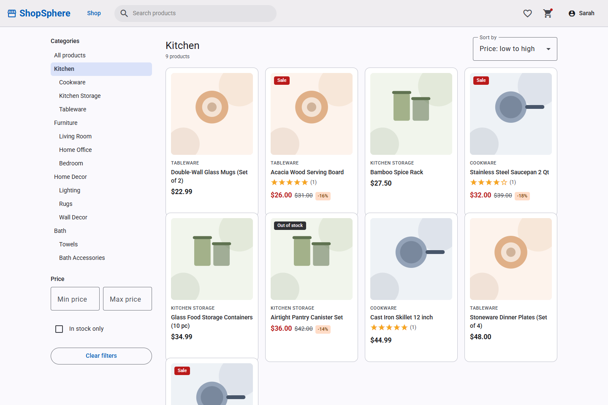
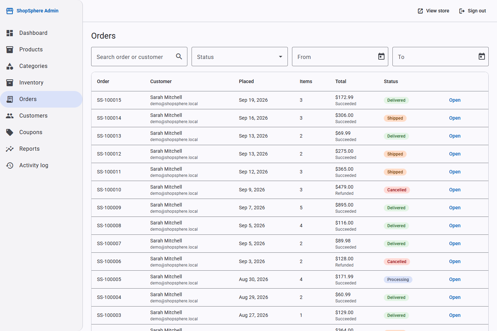
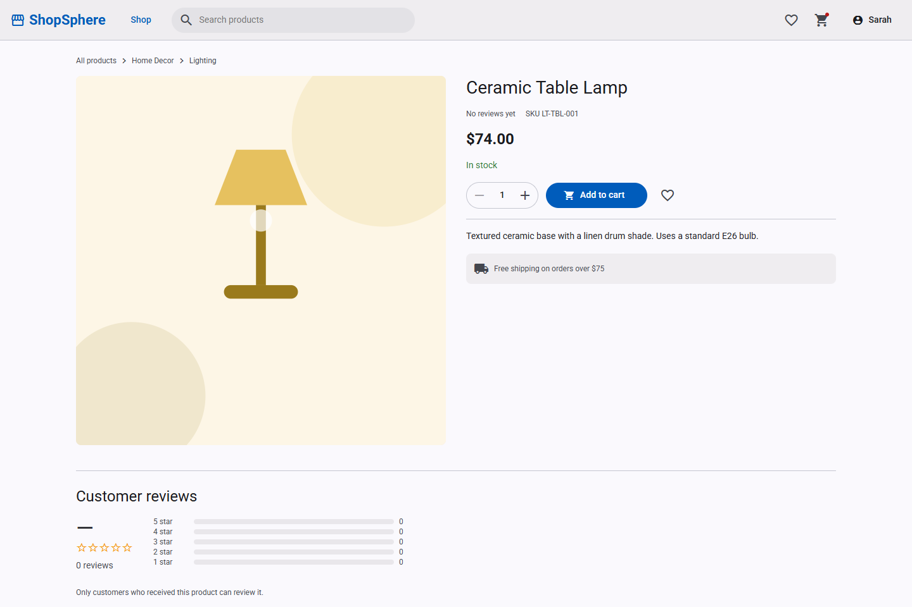
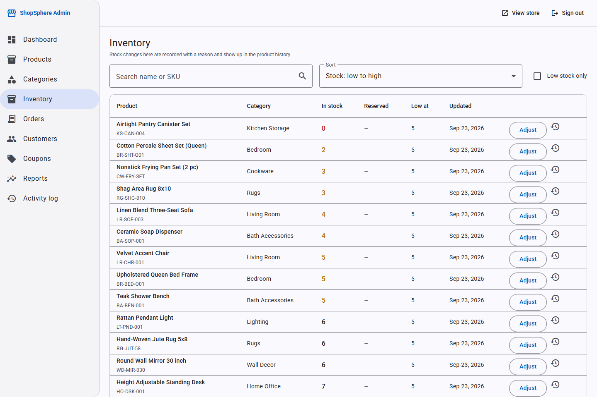
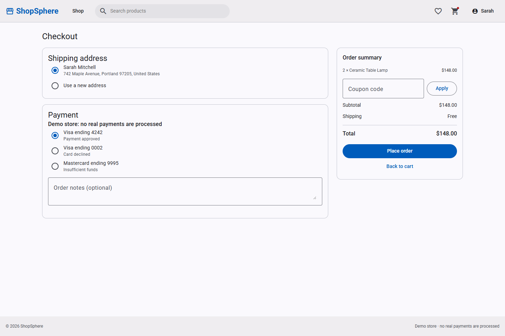
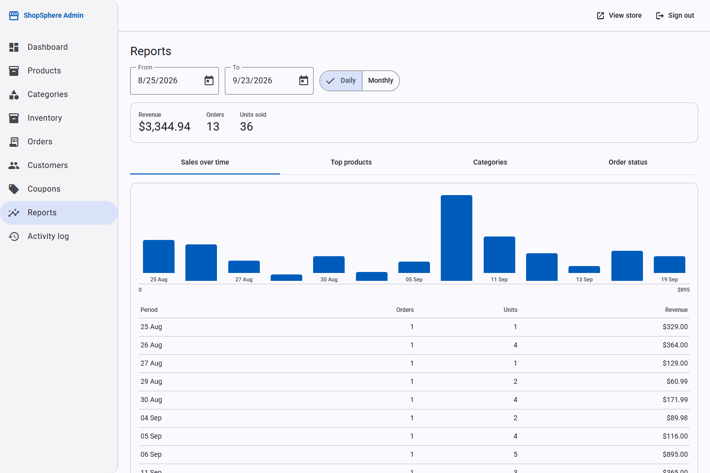
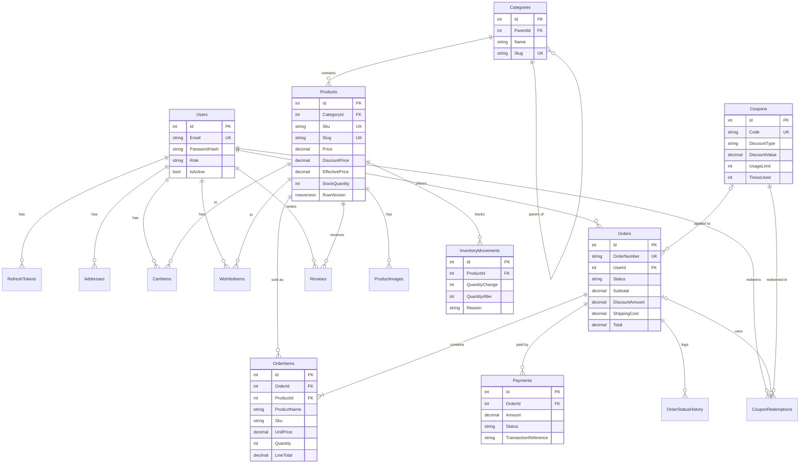

# ShopSphere

A single-vendor e-commerce platform built with **ASP.NET Core 8** and **Angular 20**: a customer storefront with catalog, cart, wishlist, checkout and order history, plus an admin area for products, inventory, orders, customers, coupons and reports.

The interesting part isn't the shopping cart, it's the rules around it. Checkout runs in a database transaction and decrements stock with a conditional update, so two customers can't buy the last unit. Order lines keep the price that was paid. Orders follow a state machine that refuses illegal transitions. Coupons enforce expiry, minimum order value and usage limits, and give the use back when an order is cancelled.

## Contents

- [Features](#features)
- [Screenshots](#screenshots)
- [Tech stack](#tech-stack)
- [Architecture](#architecture)
- [Database](#database)
- [Business rules worth a look](#business-rules-worth-a-look)
- [API](#api)
- [Getting started](#getting-started)
- [Configuration](#configuration)
- [Tests](#tests)
- [Future improvements](#future-improvements)

## Features

**Storefront**

- Registration and sign-in with JWT access tokens and rotating refresh tokens
- Category tree, keyword search, price range, availability filter, sorting and pagination, all driven by the URL
- Product pages with image gallery, stock status, and reviews
- Cart with live stock validation, wishlist, and move-to-cart
- Checkout with saved addresses, coupons, shipping rules and mock payment
- Order history, order timeline, payment retry and cancellation
- Account profile, password change and address book

**Admin**

- Dashboard: revenue, orders, new customers, pending orders, low stock, recent orders, revenue chart
- Products: table with filters, create/edit form, image upload, optimistic concurrency
- Categories: nested tree with cycle and delete protection
- Inventory: stock adjustments with reasons, movement ledger, low-stock filter, stock reserved by unpaid orders
- Orders: queue with filters, enforced status transitions, cancellation with stock restore and refund
- Customers: spend and order history, activate/deactivate
- Coupons: full management with validity, limits and usage
- Reports: sales by date, product and category, order status summary
- Activity log: who changed what and when

## Screenshots

| Storefront | Admin |
|---|---|
| Home<br> | Dashboard<br> |
| Product listing with filters<br> | Orders<br> |
| Product details<br> | Inventory<br> |
| Checkout<br> | Reports<br> |

More in [docs/screenshots](docs/screenshots): cart, order history, product management and the storefront at phone width.

Product artwork is generated SVG illustrations so the demo looks complete out of the box; real photos can be uploaded per product from the admin.

## Tech stack

| Layer | Technologies |
|---|---|
| Backend | C#, .NET 8, ASP.NET Core Web API, Entity Framework Core 8, SQL Server, LINQ |
| Auth | JWT access tokens, rotating refresh tokens in an HttpOnly cookie, role-based policies |
| Frontend | Angular 20, TypeScript, RxJS, Angular Material, reactive forms, router, HTTP interceptors, route guards |
| Logging / docs | Serilog (console + rolling file), Swagger / OpenAPI |
| Testing | xUnit, `WebApplicationFactory` integration tests against SQL Server LocalDB |
| Tools | Visual Studio, VS Code, SQL Server Management Studio, Git, Postman |

Angular 20 is an LTS release with the same support window as .NET 8.

## Architecture

```
┌──────────────── Angular SPA (shopsphere-web) ─────────────────┐
│  Storefront (lazy routes)        Admin area (lazy, adminGuard) │
│  Feature services (RxJS) ── HttpClient                         │
│  Interceptors: auth + refresh · error · loading                │
└───────────────────────────┬────────────────────────────────────┘
                            │  /api  (dev proxy → https://localhost:7001)
┌───────────────────────────▼────────────────────────────────────┐
│ ASP.NET Core 8 Web API (ShopSphere.Api)                        │
│  Serilog request logging · IExceptionHandler → ProblemDetails  │
│  JWT authentication · AdminOnly / CustomerOnly policies        │
│  Controllers (thin) → feature services → AppDbContext          │
│  IPaymentGateway → MockPaymentGateway                          │
│  BackgroundService: releases stock from unpaid orders          │
└───────────────────────────┬────────────────────────────────────┘
                            │ EF Core 8
                    ┌───────▼────────┐
                    │   SQL Server   │
                    └────────────────┘
```

Deliberate choices:

- **One API project organised by feature** (`Features/Checkout`, `Features/Orders`, …) instead of four "clean architecture" projects. The complexity lives in the business rules, not in the layering.
- **No repository layer.** `DbContext` is already a unit of work and `DbSet` is already a repository. Services use it directly and project straight into DTOs.
- **Few interfaces.** `IPaymentGateway` exists because swapping the mock for a real provider is a real scenario; the rest are concrete classes.
- **Manual DTO mapping**, so the generated SQL only reads the columns a screen needs.
- **Entities never leave the API.** Every endpoint returns a DTO.

## Database



Details in [docs/design.md](docs/design.md). Highlights:

- **Money** is `decimal(18,2)`; `Products.EffectivePrice` is a persisted computed column (`COALESCE(DiscountPrice, Price)`) with an index, so price filters and sorting can use it.
- **Check constraints** back up the service code: stock can't go negative, a discount can't exceed the price, a rating is 1–5.
- **Delete behaviour**: anything an order references (products, users, coupons) is `Restrict` and gets deactivated instead; child data such as images and cart rows cascades.
- **Order numbers** come from a SQL sequence used as a column default (`SS-100001`).
- **`RowVersion`** on Product and Order gives optimistic concurrency for admin edits.
- **DateTimes** are stored in UTC and tagged as UTC when read, so the browser converts them correctly.

## Business rules worth a look

**Checkout** (`Features/Checkout/CheckoutService.cs`)

```
validate cart → subtotal → coupon → shipping → total
BEGIN TRANSACTION
  UPDATE Products SET StockQuantity -= @qty
  WHERE Id = @id AND IsActive = 1 AND StockQuantity >= @qty   ← 0 rows ⇒ 409
  UPDATE Coupons SET TimesUsed += 1
  WHERE Id = @id AND (UsageLimit IS NULL OR TimesUsed < UsageLimit)
  insert order + items (price snapshot) + status history + inventory movements
        + pending payment + coupon redemption, then clear the cart
COMMIT
charge the payment gateway   ← outside the transaction, it is a network call
success → Confirmed · failure → stays Pending and can be retried
```

The conditional `UPDATE` is what makes stock safe: check and decrement happen in one statement, so two customers buying the last unit can't both succeed. There's a test that runs two checkouts in parallel and asserts exactly one order exists.

**Order status**

```
Pending ──► Confirmed ──► Processing ──► Shipped ──► Delivered
   │            │              │
   └────────────┴──────────────┴──► Cancelled   (customers: only Pending/Confirmed)
```

Cancelling restores stock with a ledger entry, releases the coupon use and refunds the payment. `Delivered` and `Cancelled` are final; anything else is a 409.

**Other rules**

- Unpaid orders keep their stock for 30 minutes, then a background job cancels them and returns the stock.
- Reviews require a **delivered** order for that product, one per customer, and update the product's rating aggregate in the same transaction.
- Stock is never set directly in the admin: it is adjusted by a delta with a reason, and every change is written to the movement ledger.
- Revenue counts Confirmed, Processing, Shipped and Delivered orders. One helper defines that, and the dashboard, reports and customer spend all use it.

## API

Errors are returned as `ProblemDetails` with `400` validation, `401` unauthenticated, `403` wrong role, `404` not found, `409` business conflict. Swagger UI is at `/swagger`.

| Area | Endpoints |
|---|---|
| Auth | `POST /api/auth/register` · `login` · `refresh` · `logout` · `GET /api/auth/me` |
| Catalog | `GET /api/categories` · `GET /api/categories/{slug}` · `GET /api/products` (search, filters, sort, paging) · `GET /api/products/{slug}` |
| Reviews | `GET/POST /api/products/{id}/reviews` · `PUT/DELETE /api/reviews/{id}` |
| Cart | `GET/DELETE /api/cart` · `POST /api/cart/items` · `PUT/DELETE /api/cart/items/{productId}` |
| Wishlist | `GET /api/wishlist` · `POST/DELETE /api/wishlist/{productId}` · `POST /api/wishlist/{productId}/move-to-cart` |
| Checkout | `POST /api/checkout/summary` · `POST /api/checkout` · `POST /api/coupons/validate` |
| Orders | `GET /api/orders` · `GET /api/orders/{orderNumber}` · `POST /api/orders/{orderNumber}/cancel` · `POST /api/orders/{orderNumber}/payments` |
| Account | `GET/PUT /api/account/profile` · `PUT /api/account/password` · `GET/POST/PUT/DELETE /api/account/addresses` |
| Admin catalog | `/api/admin/products` (+ images) · `/api/admin/categories` |
| Admin operations | `/api/admin/inventory` (+ adjustments, movements) · `/api/admin/orders` (+ status) · `/api/admin/customers` · `/api/admin/coupons` |
| Admin insights | `/api/admin/dashboard` · `/api/admin/reports/{sales-by-date,sales-by-product,sales-by-category,order-status}` · `/api/admin/audit-logs` |

A Postman collection with these requests, including login scripts that store the token, is in [docs/ShopSphere.postman_collection.json](docs/ShopSphere.postman_collection.json).

## Getting started

### Prerequisites

- .NET 8 SDK (or a newer SDK that can target `net8.0`)
- Node.js 20.19+ or 22.12+
- SQL Server or SQL Server Express LocalDB
- Trusted HTTPS dev certificate: `dotnet dev-certs https --trust`

### Run the API

The API needs a JWT signing key of at least 32 characters. It isn't committed, so set it once in User Secrets; the API refuses to start without it.

```bash
dotnet tool restore
cd src/ShopSphere.Api
dotnet user-secrets set "Jwt:Key" "<a long random string, 32+ characters>"
dotnet run --launch-profile https
```

In Development the API applies migrations and seeds demo data on startup. The default connection string points at LocalDB (`(localdb)\MSSQLLocalDB`, database `ShopSphere`).

To apply migrations by hand instead:

```bash
dotnet ef database update --project src/ShopSphere.Api
```

- Swagger UI: https://localhost:7001/swagger
- Health check: https://localhost:7001/health

### Run the Angular app

```bash
cd src/shopsphere-web
npm install
npm start
```

Open http://localhost:4200. The dev server proxies `/api` and `/uploads` to the API, so the browser sees one origin and no CORS configuration is needed in development.

### Demo accounts (Development only)

| Role | Email | Password |
|---|---|---|
| Admin | admin@shopsphere.local | Admin#12345 |
| Customer | demo@shopsphere.local | Customer#12345 |

The seed creates a category tree, 32 products (some discounted, low on stock, out of stock or inactive) and four coupons: `WELCOME10`, `SAVE20`, `FLASH50` and the expired `SUMMER25`.

In Development it also seeds about a month of demo order history with mixed statuses, matching inventory movements and a handful of reviews, so the dashboard and reports have something to show on first run. Integration tests create their own data and never see it.

### Test payments

Checkout uses a mock gateway, so no payment data is involved. The checkout page offers three test cards:

| Card | Result |
|---|---|
| Visa ending 4242 | Payment approved |
| Visa ending 0002 | Card declined |
| Mastercard ending 9995 | Insufficient funds |

A declined payment leaves the order Pending with its stock reserved, and the order page offers a retry.

## Configuration

| Setting | Where | Notes |
|---|---|---|
| `ConnectionStrings:DefaultConnection` | appsettings.json | LocalDB by default |
| `Jwt:Key` | User Secrets / environment variable | Required, never committed |
| `Jwt:AccessTokenMinutes`, `Jwt:RefreshTokenDays` | appsettings.json | 15 minutes / 7 days |
| `Shipping:FlatRate`, `Shipping:FreeShippingThreshold` | appsettings.json | $5.99, free over $75 |
| `Orders:PendingTimeoutMinutes`, `Orders:ExpiryCheckIntervalMinutes` | appsettings.json | Unpaid orders release stock after 30 minutes, checked every 5 |
| `Seed:*` | appsettings.Development.json | Demo account credentials, Development only |

In production these come from environment variables (`Jwt__Key`) or a secret store. No secrets are committed to this repository.

## Tests

```bash
dotnet test
```

126 tests: unit tests for the order state machine, and integration tests that start the API in memory with `WebApplicationFactory` against a separate LocalDB database (`ShopSphere_Tests`), dropped and recreated per run.

They use a real SQL Server rather than the EF in-memory provider, because the rules depend on transactions, `ExecuteUpdate`, constraints and computed columns that the in-memory provider doesn't support.

What they cover, among others:

- two customers checking out the last unit at the same time produce exactly one order
- checkout fails when stock dropped after the product went into the cart
- an expired, unknown or below-minimum coupon is rejected and never changes the price
- a coupon's per-customer and total usage limits hold
- an order keeps the price that was paid after the product price changes
- a declined payment leaves the order Pending and a retry confirms it
- a cancelled order can't be shipped; cancelling restores stock, releases the coupon and refunds
- stock can never be adjusted below zero
- unpaid orders are cancelled after the timeout and their stock returns
- only customers with a delivered order can review a product, once
- customers can't reach admin endpoints or other customers' orders, reviews and addresses

## Future improvements

- Full-text search for the keyword filter (`LIKE '%term%'` can't use an index)
- Guest cart merged into the account on sign-in
- Real payment provider with webhooks, and email notifications
- Product images in blob storage instead of local disk
- Redis caching for the catalog and category tree
- Tax rules per region
- Rate limiting on authentication endpoints
- Docker Compose setup and a CI pipeline
