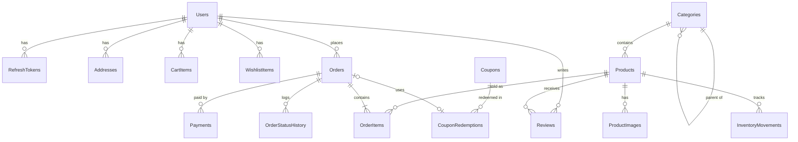

# Design notes

## Architecture

```
Angular SPA ──(/api via dev proxy)──► ASP.NET Core Web API ──► EF Core ──► SQL Server
                                        │
                                        └─► IPaymentGateway (mock implementation)
```

- One API project organised by feature (`Features/Checkout`, `Features/Orders`, ...). The controller, service and DTOs for a feature sit next to each other.
- Services use `AppDbContext` directly. There is no repository layer on top of EF Core.
- Entities never leave the API. Controllers return DTOs, mostly projected straight from LINQ queries.
- Errors are returned as `ProblemDetails` by a global `IExceptionHandler`.

## Database



Key decisions:

- **Order lines store `UnitPrice`, `ProductName` and `Sku`.** An order is a financial record. Later price changes or renames must not change past orders or revenue reports.
- **The shipping address is copied onto the order.** Customers can edit or delete saved addresses without affecting orders already shipped.
- **`Products.EffectivePrice`** is a persisted computed column (`COALESCE(DiscountPrice, Price)`), so price filtering and sorting can use an index.
- **Money** is stored as `decimal(18,2)`.
- **Delete behaviour:** products, users and coupons that appear in orders cannot be deleted (`Restrict`). They are deactivated instead.
- **Cart and wishlist** are stored as `(UserId, ProductId)` rows with a unique index. There's no header table, because a user only has one of each.

## Checkout

```
validate cart → validate stock → subtotal → coupon → shipping → total
BEGIN TRANSACTION
  decrement stock:  UPDATE Products SET StockQuantity -= @qty
                    WHERE Id = @id AND StockQuantity >= @qty
                    (0 rows affected → rollback, 409 insufficient stock)
  consume coupon usage (conditional update)
  insert order, order items, status history, inventory movements, pending payment
  clear cart
COMMIT
charge payment (outside the transaction)
success → order Confirmed · failure → order stays Pending, can retry or cancel
```

The conditional `UPDATE` does the stock check and the decrement in one atomic statement. When two customers buy the last unit at the same time, only one succeeds, with no need for serializable isolation.

## Order status

```
Pending ──► Confirmed ──► Processing ──► Shipped ──► Delivered
   │            │              │
   └────────────┴──────────────┴──► Cancelled
```

Cancelling puts the stock back and releases the coupon usage. `Delivered` and `Cancelled` are final. Any transition not in this diagram is rejected with `409 Conflict`.
